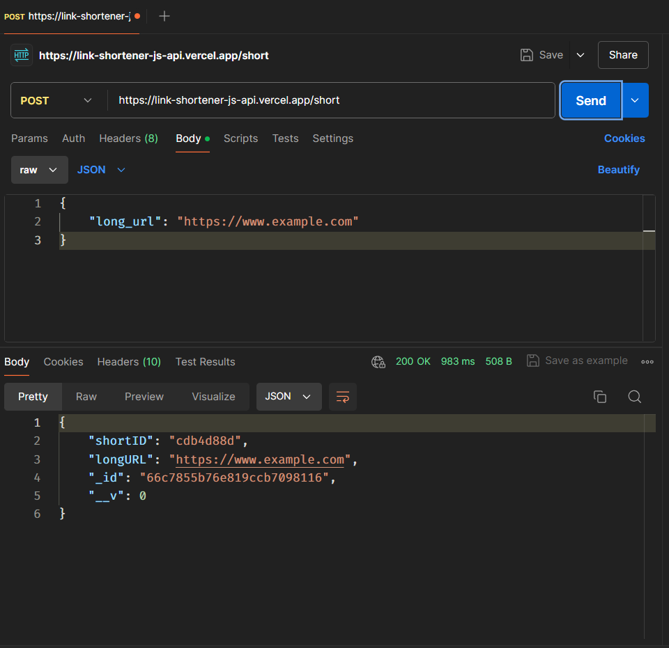
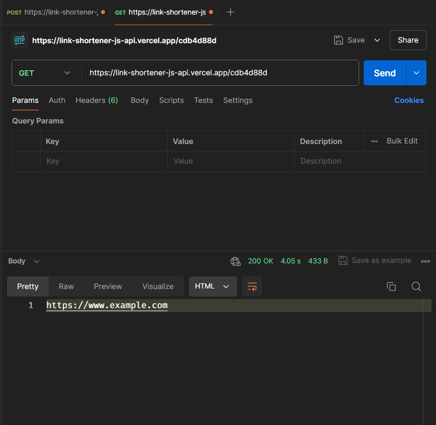

# Link Shortner JS API

---

### What's this?

This repository contains code to generate short_id for your long urls the generated output itself is not a short url but an idenrifier to help identify each long url, use this repo to generate short id for your long_url and connect your own domain with this repo to have your own link shortner with full controls.

---

### Requirements

- Node.JS v20+
- MongoDB 

---

### How to use this?

1. `git clone https://github.com/Anuragd275/Link-Shortener-JS-API.git`
2. Navigate to Link-Shorener-JS-API, open terminal and then run this command: `npm i`
3. Then run: `node app.js`
4. If you didn't mess up somewhere, the code should run on `localhost:3000`

---

### Create Short ID [POST]

---

Visit `localhost:3000/short` and pass your long_url: `"https://example.com"` with `POST` Method

`curl --location 'https://link-shortener-js-api.vercel.app/short' \
--header 'Content-Type: application/json' \
--data '{"long_url": "https://www.example.com"}'`

----

### Retrieve long_url from shortID [GET]

---

Visit `localhost:3000/<shortID>` and you'll receive your long url or

`curl --location 'https://localhost:3000/<shortID>'`

---

### Contributions

Contributions are most welcome, if you find any bugs or want to request any feature, just raise a Issue/PR suitably.

---

